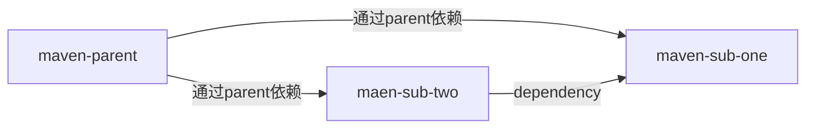

# maven日记02-父子工程

分布式服务以及微服务，都是依赖相同的jar，如果每个pom都进行定义，会造成版本管理的混乱，未来如果升级迭代的时候，增加不必要的负担和麻烦，所以搞一下父子工程。

写了个简单的demo[git link](),逻辑如下:



> ## parent-pom.xml配置如下

```xml
<?xml version="1.0" encoding="UTF-8"?>
<project xmlns="http://maven.apache.org/POM/4.0.0"
         xmlns:xsi="http://www.w3.org/2001/XMLSchema-instance"
         xsi:schemaLocation="http://maven.apache.org/POM/4.0.0 http://maven.apache.org/xsd/maven-4.0.0.xsd">
    <modelVersion>4.0.0</modelVersion>

    <groupId>com.mksun.maven</groupId>
    <artifactId>parent</artifactId>
    <version>1.0-SNAPSHOT</version>
    <parent>
        <groupId>org.springframework.boot</groupId>
        <artifactId>spring-boot-starter-parent</artifactId>
        <version>2.2.6.RELEASE</version>
        <relativePath/> <!-- lookup parent from repository -->
    </parent>
    <packaging>pom</packaging>

    <!--jar包版本管理-->
    <properties>
        <java.version>1.8</java.version>
        <spring-cloud-alibaba.version>2.2.0.RELEASE</spring-cloud-alibaba.version>
        <lombok.version>1.18.8</lombok.version>
    </properties>

    <dependencies>
        <dependency>
            <groupId>org.springframework.boot</groupId>
            <artifactId>spring-boot-starter-data-redis</artifactId>
        </dependency>
        <dependency>
            <groupId>org.springframework.boot</groupId>
            <artifactId>spring-boot-starter-web</artifactId>
        </dependency>

        <dependency>
            <groupId>mysql</groupId>
            <artifactId>mysql-connector-java</artifactId>
            <scope>runtime</scope>
        </dependency>

        <dependency>
            <groupId>org.projectlombok</groupId>
            <artifactId>lombok</artifactId>
            <optional>true</optional>
        </dependency>

        <dependency>
            <groupId>org.mybatis.spring.boot</groupId>
            <artifactId>mybatis-spring-boot-starter</artifactId>
            <version>2.1.2</version>
        </dependency>

    </dependencies>

    <dependencyManagement>
        <dependencies>
            <dependency>
                <groupId>com.alibaba.cloud</groupId>
                <artifactId>spring-cloud-alibaba-dependencies</artifactId>
                <version>${spring-cloud-alibaba.version}</version>
                <type>pom</type>
                <scope>import</scope>
            </dependency>

            <dependency>
                <groupId>org.projectlombok</groupId>
                <artifactId>lombok</artifactId>
                <version>${lombok.version}</version>
            </dependency>
        </dependencies>
    </dependencyManagement>

    <build>
        <plugins>
            <plugin>
                <groupId>org.springframework.boot</groupId>
                <artifactId>spring-boot-maven-plugin</artifactId>
            </plugin>
        </plugins>
    </build>

</project>
```

> ## Sub-one-pom.xml配置如下

```xml
<?xml version="1.0" encoding="UTF-8"?>
<project xmlns="http://maven.apache.org/POM/4.0.0" xmlns:xsi="http://www.w3.org/2001/XMLSchema-instance"
	xsi:schemaLocation="http://maven.apache.org/POM/4.0.0 https://maven.apache.org/xsd/maven-4.0.0.xsd">
	<modelVersion>4.0.0</modelVersion>
	<parent>
		<groupId>com.mksun.maven</groupId>
		<artifactId>parent</artifactId>
		<version>1.0-SNAPSHOT</version>
	</parent>
	<groupId>com.mksun.maven</groupId>
	<artifactId>sub-one</artifactId>
	<name>sub-one</name>
	<description>Demo project for Spring Boot</description>
	<packaging>pom</packaging>
</project>

```

> ## Sub-two-pom.xml配置如下

```Xml
<?xml version="1.0" encoding="UTF-8"?>
<project xmlns="http://maven.apache.org/POM/4.0.0" xmlns:xsi="http://www.w3.org/2001/XMLSchema-instance"
	xsi:schemaLocation="http://maven.apache.org/POM/4.0.0 https://maven.apache.org/xsd/maven-4.0.0.xsd">
	<modelVersion>4.0.0</modelVersion>
	<parent>
		<groupId>com.mksun.maven</groupId>
		<artifactId>parent</artifactId>
		<version>1.0-SNAPSHOT</version>
	</parent>
	<groupId>com.mksun.maven</groupId>
	<artifactId>sub-two</artifactId>
	<version>0.0.1-SNAPSHOT</version>
	<name>sub-two</name>
	<description>Demo project for Spring Boot</description>
	<packaging>pom</packaging>


	<dependencies>
		<dependency>
			<groupId>com.mksun.maven</groupId>
			<artifactId>sub-one</artifactId>
			<version>1.0-SNAPSHOT</version>
		</dependency>
	</dependencies>
  
</project>

```

